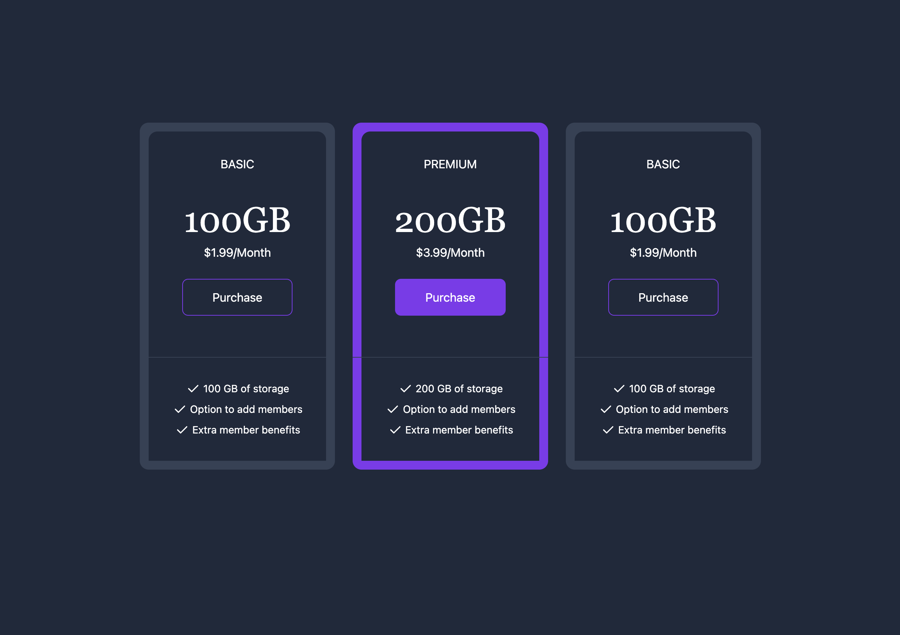

# 💳 02 - Pricing Cards

🔗 [Live Demo](https://DHodge6.github.io/tailwind-mini-projects/02-pricing-cards/)

A responsive set of pricing card components built using Tailwind CSS.  
This layout includes a highlight state, button styling, and list item icons, styled entirely with utility classes.

---

## 🖼️ Preview

---

## 🚀 Features

- Flex-based column layout with mobile stacking
- Highlighted "Premium" card with border and color emphasis
- Tailwind spacing, typography, buttons, and custom SVG icons

---

## 🔍 What I Practiced

- Responsive layouts using `flex` and `md:` breakpoints
- Button customization with Tailwind utility classes
- Layering and emphasizing elements (e.g., `z-index`, hover states)
- Using inline SVG icons for UI checklists