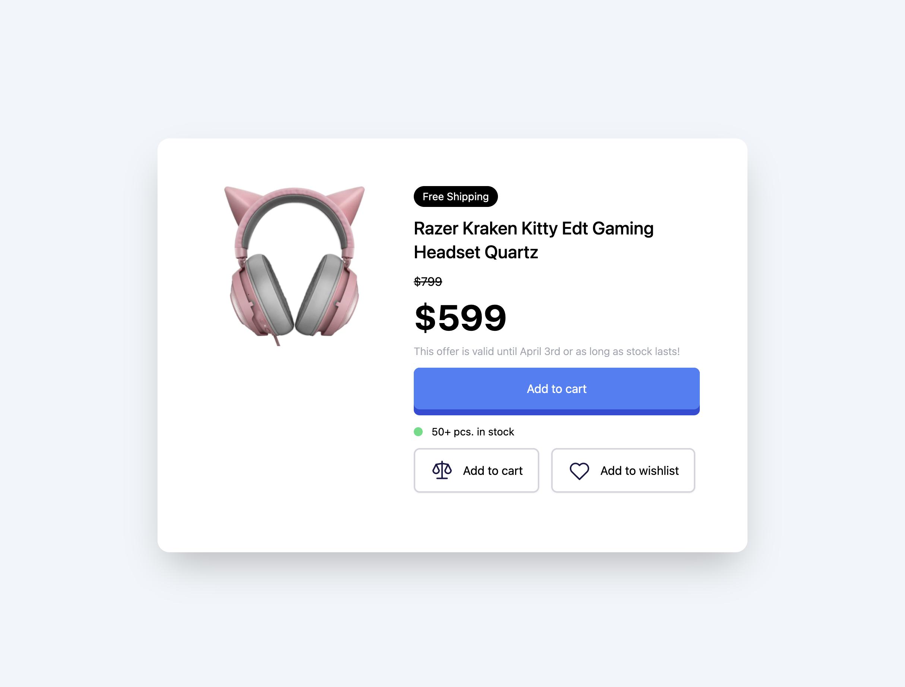

# 🎧 03 - Product Modal

🔗 [Live Demo](https://DHodge6.github.io/tailwind-mini-projects/03-product-modal/)

A responsive product modal UI built with Tailwind CSS, showcasing a feature-rich product card with image, pricing, interaction states, and stock indicators.

Created as part of the [Tailwind From Scratch](https://www.udemy.com/course/tailwind-from-scratch/) course by Brad Traversy.

---

## 🖼️ Preview

---

## 🚀 Features

- Responsive card layout with mobile-first stacking and desktop side-by-side layout
- Animated button hover effects using Tailwind's `group` utility
- Ping animation for stock availability using `group-hover`
- Scalable structure with clearly divided image and content sections
- Tailored visual hierarchy using spacing, font weights, and colors

---

## 🔍 What I Practiced

- Coordinating multiple responsive layouts using `flex-col` and `md:flex-row`
- Creating hover-based animations with `group` and `group-hover`
- Aligning and spacing internal components with `items-center`, `space-y`, and `space-x`
- Designing CTA buttons with hover transitions and accessibility-friendly contrast
- Structuring modular UI blocks that could scale into a full product page